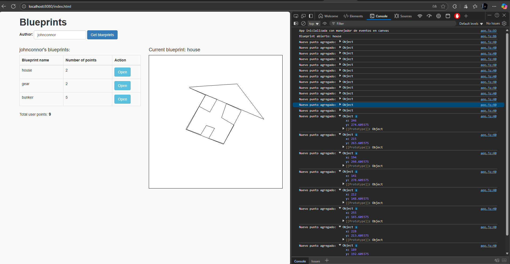
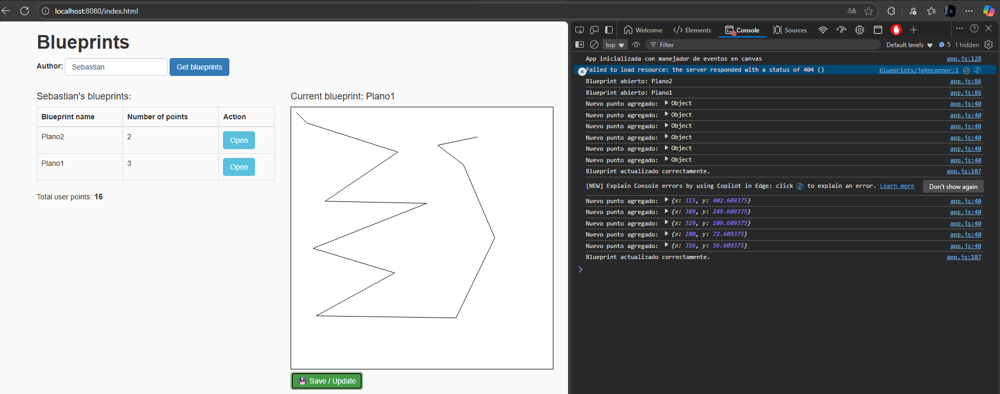
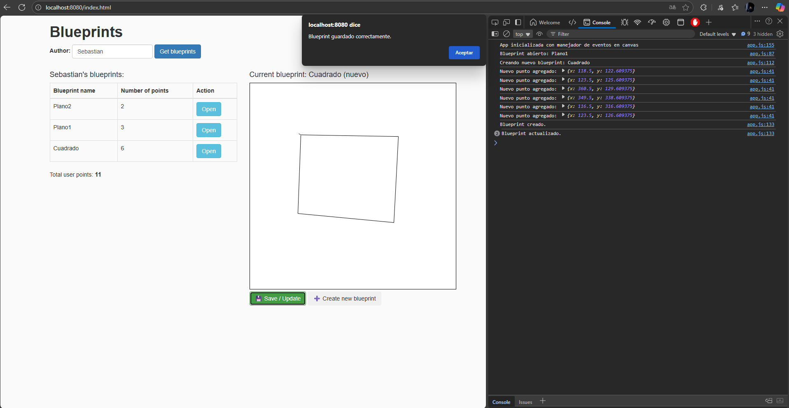
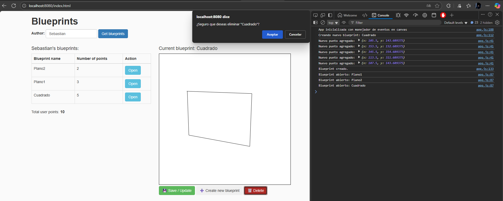

# Laboratorio 6 - Procesos de desarrollo de software - PDSW
## Sebastian Galvis Briceño

## Desarrollo:
Inicialmente en este laboratorio, contamos con todo lo trabajado en el [Laboratorio #05 de ARSW](https://github.com/sebRedi/ARSWLAB05)


Ahora, continuaremos con la construción de un cliente 'grueso' con un API REST, HTML5, Javascript y CSS3.


1. Debemos agregar al canvas de la página un manejador de eventos que permita capturar los 'clicks' realizados, bien sea a través del mouse, o a través de una pantalla táctil. Para esto, tendremos en cuenta [este ejemplo de uso de los eventos de tipo 'PointerEvent'](https://mobiforge.com/design-development/html5-pointer-events-api-combining-touch-mouse-and-pen) (aún no soportado por todos los navegadores) para este fin. Es importante recordar que a diferencia del ejemplo anterior (donde el código JS estaba incrustado en la vista), se espera tener la inicialización de los manejadores de eventos correctamente modularizado, tal como se muestra en [este codepen](https://codepen.io/hcadavid/pen/BwWbrw).

    **Desarrollo:** Para ello, modificaremos el contenido de `app.js` de la forma:
    ``` js
    // @author sebastianGalvis
    
    var app = (function () {
        var dataSource = apimock; // apiclient || apimock
        // Estado privado
        var _author = null;
        var _blueprints = [];
        var _canvas = null;
        var _ctx = null;
    
        // Función privada para calcular puntos totales
        function _calculateTotalPoints() {
            return _blueprints.map(bp => bp.points.length)
                .reduce((a, b) => a + b, 0);
        }
    
        // Función privada para dibujar un blueprint en canvas
        function _drawBlueprint(bp) {
            _ctx.clearRect(0, 0, _canvas.width, _canvas.height); // limpiar antes de dibujar
            if (bp.points.length > 0) {
                _ctx.beginPath();
                _ctx.moveTo(bp.points[0].x, bp.points[0].y);
                for (var i = 1; i < bp.points.length; i++) {
                    _ctx.lineTo(bp.points[i].x, bp.points[i].y);
                }
                _ctx.stroke();
            }
        }
    
        // Función privada para manejar clics o toques en el canvas
        function _handleCanvasClick(x, y) {
            console.log("Click detectado en:", x, y);
            alert("Click en coordenadas: " + x + ", " + y);
            // Más adelante se podría agregar lógica para dibujar puntos o añadir coordenadas al blueprint actual
        }
    
        // API pública del módulo
        return {
            setAuthor: function (authorName) {
                _author = authorName;
            },
    
            getBlueprints: function () {
                return dataSource.getBlueprintsByAuthor(_author, function (data) {
                    if (!data || data.length === 0) {
                        // si no hay planos
                        $("#blueprintsTable").empty();
                        $("#totalPoints").text(0);
                        $("#selectedAuthor").text(_author + " (sin planos)");
                        return;
                    }
    
                    _blueprints = data;
                    $("#selectedAuthor").text(_author);
    
                    // construir tabla
                    var table = $("#blueprintsTable");
                    table.empty();
                    data.forEach(bp => {
                        var row = `<tr>
                            <td>${bp.name}</td>
                            <td>${bp.points.length}</td>
                            <td><button class="btn btn-info" onclick="app.openBlueprint('${bp.name}')">Open</button></td>
                        </tr>`;
                        table.append(row);
                    });
    
                    $("#totalPoints").text(_blueprints.map(bp => bp.points.length).reduce((a, b) => a + b, 0));
                });
            },
    
            openBlueprint: function (bpName) {
                dataSource.getBlueprintsByNameAndAuthor(_author, bpName, function (bp) {
                    if (bp) {
                        $("#currentBlueprint").text(bp.name);
                        _drawBlueprint(bp);
                    }
                });
            },
    
            // Inicializar eventos en el canvas
            init: function () {
                console.info("App inicializada con manejador de eventos en canvas");
    
                _canvas = document.getElementById("blueprintCanvas");
                _ctx = _canvas.getContext("2d");
    
                if (window.PointerEvent) {
                    _canvas.addEventListener("pointerdown", function (event) {
                        const rect = _canvas.getBoundingClientRect();
                        const x = event.clientX - rect.left;
                        const y = event.clientY - rect.top;
                        _handleCanvasClick(x, y);
                    });
                } else {
                    _canvas.addEventListener("mousedown", function (event) {
                        const rect = _canvas.getBoundingClientRect();
                        const x = event.clientX - rect.left;
                        const y = event.clientY - rect.top;
                        _handleCanvasClick(x, y);
                    });
                }
            }
        };
    })();
    ```

    Al cargar la página, podemos ver que todo funciona sin errores
    
    


2. Ahora vamos a agregar lo que haga falta en los módulos para que cuando se capturen nuevos puntos en el canvas abierto (si no se ha seleccionado un canvas NO se debe hacer nada):
   * Se agregue el punto al final de la secuencia de puntos del canvas actual (sólo en la memoria de la aplicación, AÚN NO EN EL API!).
   * Se repinte el dibujo.

    **Desarrollo**: Será necesario tener un control sobre el plano actualmente abierto con:
    ``` js
    var _currentBlueprint = null;
    ```

    Ahora, modificaremos la función que maneja los clicks en el canvas de la forma:

    ``` js
    // Función privada para manejar clics o toques en el canvas
    function _handleCanvasClick(x, y) {
        // Si no hay un plano seleccionado, no hacer nada
        if (!_currentBlueprint) {
            console.warn("No hay blueprint seleccionado. Ignorando clic.");
            return;
        }
        // Agregar el punto al blueprint actual (solo en memoria)
        _currentBlueprint.points.push({ x: x, y: y });
        console.log("Nuevo punto agregado:", { x, y });
        // Repintar el blueprint con el nuevo punto
        _drawBlueprint(_currentBlueprint);
    }
    ```
   
    También tendremos que modificar la función `openBlueprint` de la forma:

    ``` js
    openBlueprint: function (bpName) {
        dataSource.getBlueprintsByNameAndAuthor(_author, bpName, function (bp) {
            if (bp) {
                _currentBlueprint = bp;
                $("#currentBlueprint").text(bp.name);
                _drawBlueprint(bp);
                console.info("Blueprint abierto:", bp.name);
            }
        });
    }
    ```
   
    De esta forma, podremos obtener el funcionamiento deseado:

    


3. Ahora agregaremos el botón Save/Update. Respetando la arquitectura de módulos actual del cliente, haremos que al oprimirse el botón:
   * Se haga PUT al API, con el plano actualizado, en su recurso REST correspondiente. 
   * Se haga GET al recurso /blueprints, para obtener de nuevo todos los planos realizados. 
   * Se calculen nuevamente los puntos totales del usuario.

   Para lo anterior es necesario tener en cuenta:
    * jQuery no tiene funciones para peticiones PUT o DELETE, por lo que es necesario 'configurarlas' manualmente a través del API para AJAX. Por ejemplo, para hacer una peticion PUT a un recurso /myrecurso:
        ``` js
        return $.ajax({
            url: "/mirecurso",
            type: 'PUT',
            data: '{"prop1":1000,"prop2":"papas"}',
            contentType: "application/json"
        });
        ```
    
    Para éste podemos notar que la propiedad 'data' del objeto enviado a $.ajax debe ser un objeto jSON (en formato de texto). Si el dato que se quiere enviar es un objeto JavaScript, se puede convertir a jSON con:

    ``` js
    JSON.stringify(objetojavascript),
    ```

   * Como en este caso se tienen tres operaciones basadas en callbacks, y que las mismas requieren realizarse en un orden específico, es necesario tener en cuenta cómo usar las promesas de JavaScript mediante alguno de los ejemplos disponibles.

    **Desarrollo:** Será necesario actualizar el `aplicient.js`.

    ``` js
    updateBlueprint: function (authname, bpname, blueprint) {
        return $.ajax({
            url: "/blueprints/" + authname + "/" + bpname,
            type: 'PUT',
            data: JSON.stringify(blueprint),
            contentType: "application/json"
        });
    }
    ```
    
    También será necesario agregar la siguiente función al API pública de `app.js`:

    ``` js
        saveBlueprint: function () {
            if (!_currentBlueprint) {
                alert("No hay un blueprint seleccionado para guardar.");
                return;
            }

            const name = _currentBlueprint.name;
            const blueprintData = {
                author: _author,
                name: name,
                points: _currentBlueprint.points
            };

            //PUT: actualizar blueprint
            dataSource.updateBlueprint(_author, name, blueprintData)
                .then(() => {
                    console.log("Blueprint actualizado correctamente.");
                    //GET: volver a traer todos los blueprints
                    return new Promise((resolve, reject) => {
                        dataSource.getBlueprintsByAuthor(_author, function (data) {
                            _blueprints = data;
                            resolve();
                        });
                    });
                })
                .then(() => {
                    //Recalcular puntos y actualizar vista
                    $("#totalPoints").text(_calculateTotalPoints());
                    alert("Blueprint guardado y puntos actualizados.");
                })
                .catch(() => {
                    alert("Error al actualizar el blueprint.");
                });
        },
    ```

    Ahora, agregaremos el botón al html de la forma:

    ``` html
    <div class="col-md-6">
        <h4>Current blueprint: <span id="currentBlueprint">None</span></h4>
        <canvas id="blueprintCanvas" width="500" height="500" style="border:1px solid black;"></canvas>
        <br>
        <button class="btn btn-success mt-3" onclick="app.saveBlueprint()">💾 Save / Update</button>
    </div>
    ```

    **Resultado:**
    


4. Ahora vamos a agregar el botón 'Create new blueprint', de manera que cuando se oprima:
   * Se borre el canvas actual. 
   * Se solicite el nombre del nuevo 'blueprint' (nosotros decidimos la manera de hacerlo). 

   Esta opción debe cambiar la manera como funciona la opción 'save/update', pues en este caso, al oprimirse la primera vez debe (igualmente, usando promesas):

    * Hacer POST al recurso /blueprints, para crear el nuevo plano. 
    * Hacer GET a este mismo recurso, para actualizar el listado de planos y el puntaje del usuario.

    **Desarrollo:**

    Empecemos por agregar el botón para crear un nuevo plano
    ``` html
    <div class="col-md-6">
        <h4>Current blueprint: <span id="currentBlueprint">None</span></h4>
        <canvas id="blueprintCanvas" width="500" height="500" style="border:1px solid black;"></canvas>
        <br>
        <button class="btn btn-success mt-3" onclick="app.saveBlueprint()">💾 Save / Update</button>
        <button class="btn btn-secondary mt-3 ml-2" onclick="app.createNewBlueprint()">➕ Create new blueprint</button>
    </div>
    ```
   
    Ahora, agregaremos el POST al `apliclient.js`:

    ``` js
    createBlueprint: function (blueprint) {
        return $.ajax({
            url: "/blueprints",
            type: 'POST',
            data: JSON.stringify(blueprint),
            contentType: "application/json"
        });
    }
    ```

    En lo que respecta al `app.js`, necesitaremos controlar si estamos creando con

    ``` js
    var _isCreating = false;
    ```

    Así mismo, tendremos que crear la función que permitirá crear un blueprint desde cero:

    ``` js
        createNewBlueprint: function () {
            if (!_author) {
                alert("Primero selecciona un autor.");
                return;
            }
            const newName = prompt("Ingrese el nombre del nuevo blueprint:");
            if (!newName) {
                alert("Debe ingresar un nombre válido.");
                return;
            }
            // Limpiar canvas
            _ctx.clearRect(0, 0, _canvas.width, _canvas.height);
            // Crear nuevo objeto blueprint en memoria
            _currentBlueprint = {
                author: _author,
                name: newName,
                points: []
            };
            _isCreating = true;
            $("#currentBlueprint").text(newName + " (nuevo)");
            console.info("Creando nuevo blueprint:", newName);
        },
    ```

    Por último, vamos a modificar el método saveBlueprint de la forma:

    ``` js
        saveBlueprint: function () {
            if (!_currentBlueprint) {
                alert("No hay un blueprint seleccionado para guardar.");
                return;
            }
            const name = _currentBlueprint.name;
            const blueprintData = {
                author: _author,
                name: name,
                points: _currentBlueprint.points
            };
            // Si es un nuevo blueprint, POST
            const operation = _isCreating
                ? dataSource.createBlueprint(blueprintData)
                : dataSource.updateBlueprint(_author, name, blueprintData);
            // Ejecutar POST o PUT
            operation
                .then(() => {
                    console.log(_isCreating ? "Blueprint creado." : "Blueprint actualizado.");
                    _isCreating = false;
                    // Refrescar los blueprints del autor
                    return new Promise((resolve, reject) => {
                        dataSource.getBlueprintsByAuthor(_author, function (data) {
                            _blueprints = data;
                            resolve();
                        });
                    });
                })
                .then(() => {
                    // Recalcular puntos
                    $("#totalPoints").text(_calculateTotalPoints());
                    alert("Blueprint guardado correctamente.");
                })
                .catch(() => {
                    alert("Error al guardar el blueprint.");
                });
        },
    ```

    **Resultado:**
    


5. Ahora vamos a agregar el botón 'DELETE', de manera que (también con promesas):
   * Borre el canvas.
   * Haga DELETE del recurso correspondiente.
   * Haga GET de los planos ahora disponibles.

    **Desarrollo:** 
    Tal y como lo hemos hecho ya, vamos a crear el método delete en el `apiclient.js`:

    ``` js 
    deleteBlueprint: function (authname, bpname) {
        return $.ajax({
            url: "/blueprints/" + authname + "/" + bpname,
            type: 'DELETE'
        });
    }
    ```
   
    Posteriormente, creamos la función pública en `app.js`:

    ``` js
        deleteBlueprint: function () {
            if (!_currentBlueprint) {
                alert("No hay un blueprint seleccionado para eliminar.");
                return;
            }
            if (!confirm(`¿Seguro que deseas eliminar "${_currentBlueprint.name}"?`)) {
                return;
            }
            const name = _currentBlueprint.name;
            // DELETE: eliminar el blueprint
            dataSource.deleteBlueprint(_author, name)
                .then(() => {
                    console.log("Blueprint eliminado correctamente.");
                    _clearCanvas();
                    _currentBlueprint = null;
                    // GET: obtener blueprints actualizados
                    return new Promise((resolve, reject) => {
                        dataSource.getBlueprintsByAuthor(_author, function (data) {
                            _blueprints = data;
                            resolve();
                        });
                    });
                })
                .then(() => {
                    // Recalcular puntos
                    $("#totalPoints").text(_calculateTotalPoints());
                    alert("Blueprint eliminado y lista actualizada.");
                })
                .catch(() => {
                    alert("Error al eliminar el blueprint.");
                });
        },
    ```

    Por último, agregaremos el botón en el html:
    
    ``` html
    <div class="col-md-6">
        <h4>Current blueprint: <span id="currentBlueprint">None</span></h4>
        <canvas id="blueprintCanvas" width="500" height="500" style="border:1px solid black;"></canvas>
        <br>
        <button class="btn btn-success mt-3" onclick="app.saveBlueprint()">💾 Save / Update</button>
        <button class="btn btn-secondary mt-3 ml-2" onclick="app.createNewBlueprint()">➕ Create new blueprint</button>
        <button class="btn btn-danger mt-3 ml-2" onclick="app.deleteBlueprint()">🗑️ Delete</button>
    </div>
   ```

    **Resultado:**

   
    


