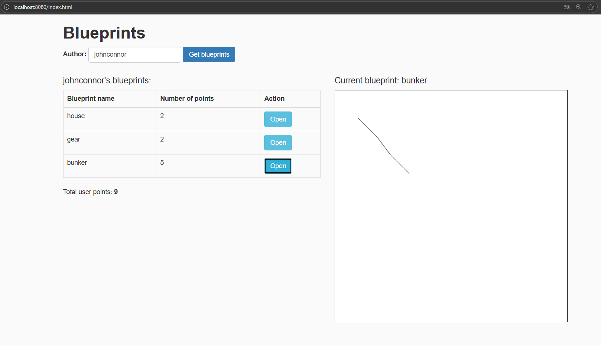
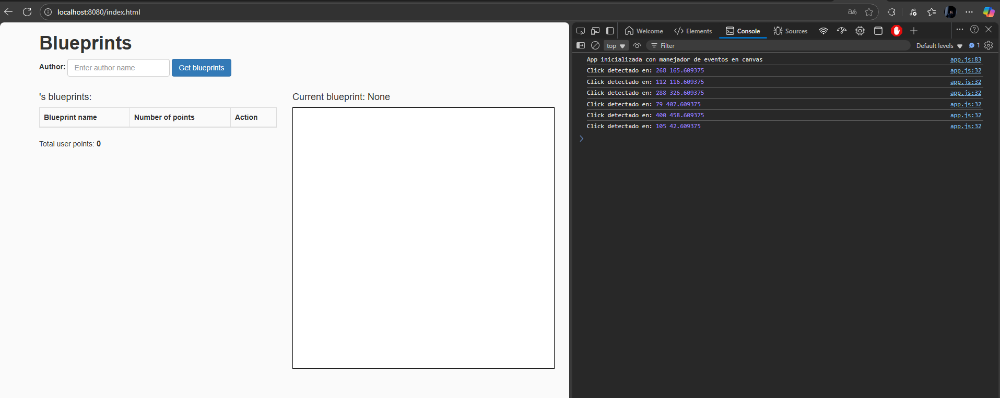

# Laboratorio 6 - Procesos de desarrollo de software - PDSW
## Sebastian Galvis Briceño

## Desarrollo:
Inicialmente en este laboratorio, contamos con todo lo trabajado en el [Laboratorio #05 de ARSW](https://github.com/sebRedi/ARSWLAB05)


Ahora, continuaremos con la construción de un cliente 'grueso' con un API REST, HTML5, Javascript y CSS3.


1. Debemos agregar al canvas de la página un manejador de eventos que permita capturar los 'clicks' realizados, bien sea a través del mouse, o a través de una pantalla táctil. Para esto, tendremos en cuenta [este ejemplo de uso de los eventos de tipo 'PointerEvent'](https://mobiforge.com/design-development/html5-pointer-events-api-combining-touch-mouse-and-pen) (aún no soportado por todos los navegadores) para este fin. Es importante recordar que a diferencia del ejemplo anterior (donde el código JS estaba incrustado en la vista), se espera tener la inicialización de los manejadores de eventos correctamente modularizado, tal como se muestra en [este codepen](https://codepen.io/hcadavid/pen/BwWbrw).

    **Desarrollo:** Para ello, modificaremos el contenido de `app.js` de la forma:
    ``` js
    // @author sebastianGalvis
    
    var app = (function () {
        var dataSource = apimock; // apiclient || apimock
        // Estado privado
        var _author = null;
        var _blueprints = [];
        var _canvas = null;
        var _ctx = null;
    
        // Función privada para calcular puntos totales
        function _calculateTotalPoints() {
            return _blueprints.map(bp => bp.points.length)
                .reduce((a, b) => a + b, 0);
        }
    
        // Función privada para dibujar un blueprint en canvas
        function _drawBlueprint(bp) {
            _ctx.clearRect(0, 0, _canvas.width, _canvas.height); // limpiar antes de dibujar
            if (bp.points.length > 0) {
                _ctx.beginPath();
                _ctx.moveTo(bp.points[0].x, bp.points[0].y);
                for (var i = 1; i < bp.points.length; i++) {
                    _ctx.lineTo(bp.points[i].x, bp.points[i].y);
                }
                _ctx.stroke();
            }
        }
    
        // Función privada para manejar clics o toques en el canvas
        function _handleCanvasClick(x, y) {
            console.log("Click detectado en:", x, y);
            alert("Click en coordenadas: " + x + ", " + y);
            // Más adelante se podría agregar lógica para dibujar puntos o añadir coordenadas al blueprint actual
        }
    
        // API pública del módulo
        return {
            setAuthor: function (authorName) {
                _author = authorName;
            },
    
            getBlueprints: function () {
                return dataSource.getBlueprintsByAuthor(_author, function (data) {
                    if (!data || data.length === 0) {
                        // si no hay planos
                        $("#blueprintsTable").empty();
                        $("#totalPoints").text(0);
                        $("#selectedAuthor").text(_author + " (sin planos)");
                        return;
                    }
    
                    _blueprints = data;
                    $("#selectedAuthor").text(_author);
    
                    // construir tabla
                    var table = $("#blueprintsTable");
                    table.empty();
                    data.forEach(bp => {
                        var row = `<tr>
                            <td>${bp.name}</td>
                            <td>${bp.points.length}</td>
                            <td><button class="btn btn-info" onclick="app.openBlueprint('${bp.name}')">Open</button></td>
                        </tr>`;
                        table.append(row);
                    });
    
                    $("#totalPoints").text(_blueprints.map(bp => bp.points.length).reduce((a, b) => a + b, 0));
                });
            },
    
            openBlueprint: function (bpName) {
                dataSource.getBlueprintsByNameAndAuthor(_author, bpName, function (bp) {
                    if (bp) {
                        $("#currentBlueprint").text(bp.name);
                        _drawBlueprint(bp);
                    }
                });
            },
    
            // Inicializar eventos en el canvas
            init: function () {
                console.info("App inicializada con manejador de eventos en canvas");
    
                _canvas = document.getElementById("blueprintCanvas");
                _ctx = _canvas.getContext("2d");
    
                if (window.PointerEvent) {
                    _canvas.addEventListener("pointerdown", function (event) {
                        const rect = _canvas.getBoundingClientRect();
                        const x = event.clientX - rect.left;
                        const y = event.clientY - rect.top;
                        _handleCanvasClick(x, y);
                    });
                } else {
                    _canvas.addEventListener("mousedown", function (event) {
                        const rect = _canvas.getBoundingClientRect();
                        const x = event.clientX - rect.left;
                        const y = event.clientY - rect.top;
                        _handleCanvasClick(x, y);
                    });
                }
            }
        };
    })();
    ```

    Al cargar la página, podemos ver que todo funciona sin errores
    
    


2. Ahora vamos a agregar lo que haga falta en los módulos para que cuando se capturen nuevos puntos en el canvas abierto (si no se ha seleccionado un canvas NO se debe hacer nada):
   * Se agregue el punto al final de la secuencia de puntos del canvas actual (sólo en la memoria de la aplicación, AÚN NO EN EL API!).
   * Se repinte el dibujo.

    **Desarrollo**: Será necesario tener un control sobre el plano actualmente abierto con:
    ``` js
    var _currentBlueprint = null;
    ```


    


